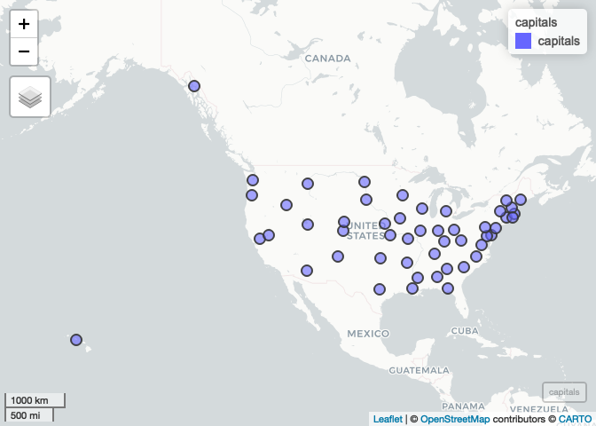
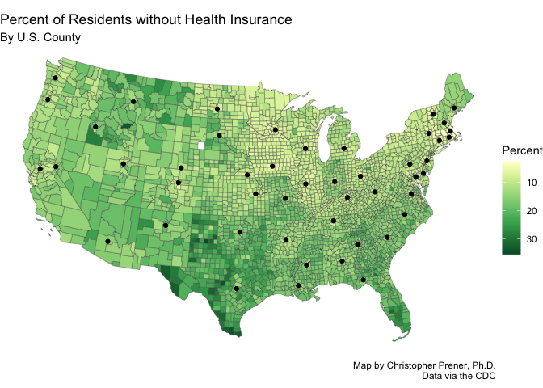
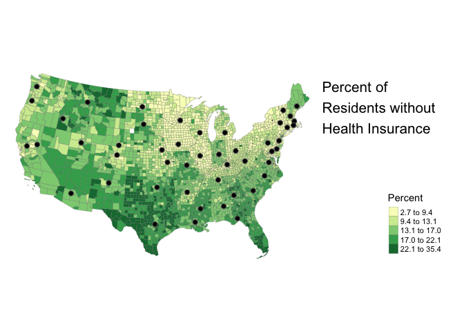

Lab-A Replication
================
Christopher Prener, Ph.D.
(April 03, 2020)

## Introduction

This notebook replicates the results of Lab-A.

## Dependencies

This notebook requires the following packages:

``` r
# tidyverse packages
library(dplyr)    # data manipulation
```

    ## 
    ## Attaching package: 'dplyr'

    ## The following objects are masked from 'package:stats':
    ## 
    ##     filter, lag

    ## The following objects are masked from 'package:base':
    ## 
    ##     intersect, setdiff, setequal, union

``` r
library(ggplot2)  # mapping
library(readr)    # import tabular data

# spatial packages
library(mapview)  # interactive map preview
library(tmap)     # mapping
library(sf)       # methods for spatial data
```

    ## Linking to GEOS 3.7.2, GDAL 2.4.2, PROJ 5.2.0

``` r
# other packages
library(here)     # file path management
```

    ## here() starts at /Users/prenercg/GitHub/slu-soc5650/lecture-a/assignments/lab-a

## Load Data

This notebook requires three data sets:

``` r
# spatial 
county_bnd <-st_read(here("data","US_BOUNDARY_Counties","US_BOUNDARY_Counties.shp"), stringsAsFactors = FALSE)
```

    ## Reading layer `US_BOUNDARY_Counties' from data source `/Users/prenercg/GitHub/slu-soc5650/lecture-a/assignments/lab-a/data/US_BOUNDARY_Counties/US_BOUNDARY_Counties.shp' using driver `ESRI Shapefile'
    ## Simple feature collection with 3220 features and 5 fields
    ## geometry type:  MULTIPOLYGON
    ## dimension:      XY
    ## bbox:           xmin: -179.1743 ymin: 17.91377 xmax: 179.7739 ymax: 71.35256
    ## epsg (SRID):    NA
    ## proj4string:    +proj=longlat +ellps=GRS80 +no_defs

``` r
# tabular
capitals <- read_csv(here("data", "stateCapitals.csv"))
```

    ## Parsed with column specification:
    ## cols(
    ##   name = col_character(),
    ##   description = col_character(),
    ##   latitude = col_double(),
    ##   longitude = col_double()
    ## )

``` r
health_ins <- read_csv(here("data","US_HEALTH_noIns.csv"))
```

    ## Parsed with column specification:
    ## cols(
    ##   GEOID = col_character(),
    ##   state = col_character(),
    ##   county = col_character(),
    ##   noIns = col_double()
    ## )

## Part 1

### Question 1

#### A

First, we’ll project the state capitals data. THe data are in decimal
degrees, so we’ll use the geogrpahic coordinate system NAD 1983 to
project them. The `crs` value for that projection is 4269

``` r
# project
capitals <- st_as_sf(capitals, coords = c("longitude", "latitude"), crs = 4269)

# check
mapview(capitals)
```

<!-- -->

#### B

We have projected data\! We’ll go ahead and save these data, and then
remove Alaska and Hawaii:

``` r
# save data
st_write(capitals, here("data", "cleanData", "US_CAPITALS_State", "US_CAPITALS_State.shp"),
         delete_dsn = TRUE)
```

    ## Warning in abbreviate_shapefile_names(obj): Field names abbreviated for ESRI
    ## Shapefile driver

    ## Deleting source `/Users/prenercg/GitHub/slu-soc5650/lecture-a/assignments/lab-a/data/cleanData/US_CAPITALS_State/US_CAPITALS_State.shp' using driver `ESRI Shapefile'
    ## Writing layer `US_CAPITALS_State' to data source `/Users/prenercg/GitHub/slu-soc5650/lecture-a/assignments/lab-a/data/cleanData/US_CAPITALS_State/US_CAPITALS_State.shp' using driver `ESRI Shapefile'
    ## Writing 50 features with 2 fields and geometry type Point.

``` r
# subset
capitals <- filter(capitals, name %in% c("Alaska", "Hawaii") == FALSE)
```

#### C

Next, we need to combine our county data in `county_bnd` with the
`health_ins` data. First, we want to join these data. `GEOID` appears to
be a common variable among them, but it is character in one data.frame
and numeric in the other. To fix this, we can `mutate` one class to
match the other.

``` r
health_ins <- mutate(health_ins, GEOID = as.numeric(GEOID))
```

Now we can table join as usual.

``` r
cnty_health <- left_join(county_bnd, health_ins, by = "GEOID")
```

#### Part D

We want to subset our data to remove the observations with missing data.
Since we know that \(-1\) denotes missing data, we’ll `filter` for
observations where `noIns` is \(>=0\)

``` r
cnty_health <- filter(cnty_health, noIns >= 0)
```

#### Part E

Next, we’ll repeat the same subsetting that we did with the capitals:

``` r
# subset
cnty_health <- filter(cnty_health, state %in% c("Alaska", "Hawaii") == FALSE)
```

We could also use the `STATEFP` variable:

``` r
cnty_health <- filter(cnty_health, STATEFP %in% c("02", "15") == FALSE)
```

Both approaches work equally well in this case.

#### Part F

Finally, we’ll export our
data:

``` r
st_write(cnty_health, here("data", "cleanData", "US_HEALTH_noIns", "US_HEALTH_noIns.shp"),
         delete_dsn = TRUE)
```

    ## Deleting source `/Users/prenercg/GitHub/slu-soc5650/lecture-a/assignments/lab-a/data/cleanData/US_HEALTH_noIns/US_HEALTH_noIns.shp' using driver `ESRI Shapefile'
    ## Writing layer `US_HEALTH_noIns' to data source `/Users/prenercg/GitHub/slu-soc5650/lecture-a/assignments/lab-a/data/cleanData/US_HEALTH_noIns/US_HEALTH_noIns.shp' using driver `ESRI Shapefile'
    ## Writing 3107 features with 8 fields and geometry type Multi Polygon.

## Part 2

### Question 2

Next, we’ll apply the Lambert project coordinate system to both of our
data objects:

``` r
### insurance data
cnty_health <- st_transform(cnty_health, crs = 102004)

### capitals
capitals <- st_transform(capitals, crs = 102004)
```

Now our data are ready for mapping.

### Questions 3-5, `ggplot2`

First, we’ll make our plot using `ggplot2`. I’ll use the `lwd` argument
to diminish the lines around each of the counties:

``` r
ggplot() +
  geom_sf(data = cnty_health, mapping = aes(fill = noIns), lwd = .15) +
  geom_sf(data = capitals) +
  scale_fill_distiller(palette = "YlGn", trans = "reverse", name = "Percent") +
  labs(
    title = "Percent of Residents without Health Insurance",
    subtitle = "By U.S. County",
    caption = "Map by Christopher Prener, Ph.D.\nData via the CDC"
  ) +
  theme_void() -> map1

map1
```

<!-- -->

### Questions 3-5, `tmap`

First, we’ll make our plot using `ggplot2`. I’ll use the `lwd` argument
to diminish the lines around each of the counties:

``` r
tm_shape(cnty_health) +
  tm_polygons(col = "noIns",
              palette = "YlGn",
              style = "jenks",
              title = "Percent", 
              lwd = .25) +
  tm_shape(capitals) +
    tm_symbols(
      col = "#000000",
      size = 0.25) +
  tm_layout(
    title = "Percent of\nResidents without\nHealth Insurance",
    frame = FALSE,
    legend.outside = TRUE,
    legend.position = c("right", "bottom")
  ) -> map2

map2
```

<!-- -->

### Question 6, `ggplot2`

Next, we’ll save our `ggplot2` map:

``` r
ggsave(here("results", "ggplot2_map.png"), map1, dpi = 500)
```

    ## Saving 7 x 5 in image

### Question 6, `tamp`

Finally, we’ll save our `tmap`
map:

``` r
tmap_save(tm = map2, filename = here("results", "tmap_map.png"), dpi = 500)
```

    ## Map saved to /Users/prenercg/GitHub/slu-soc5650/lecture-a/assignments/lab-a/results/tmap_map.png

    ## Resolution: 4413.805 by 2775.383 pixels

    ## Size: 8.82761 by 5.550766 inches (500 dpi)
