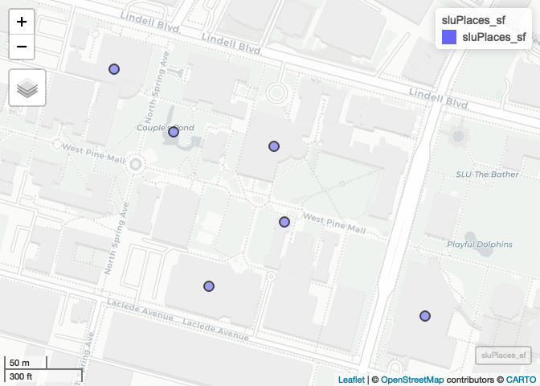

Lecture-A Examples, Completed
================
Christopher Prener, Ph.D.
(March 30, 2020)

## Introduction

This notebook provides additional examples of data cleaning plus new
material on table joins and exporting data.

## Dependencies

This notebook requires a number of packages:

``` r
# tidyverse packages
library(readr)       # read/write tabular data

# spatial packages
library(mapview)     # preview spatial data
library(sf)          # spatial data tools
```

    ## Linking to GEOS 3.7.2, GDAL 2.4.2, PROJ 5.2.0

``` r
# other packages
library(here)        # file path management
```

    ## here() starts at /Users/prenercg/GitHub/slu-soc5650/lecture-a

## Load Data

This notebook requires one set of data:

``` r
sluPlaces <- read_csv(here("data", "example-data", "sluPlaces.csv"))
```

    ## Parsed with column specification:
    ## cols(
    ##   id = col_double(),
    ##   name = col_character(),
    ##   lng = col_double(),
    ##   lat = col_double()
    ## )

## Data Cleaning Notes

Make sure your `x` and `y` coordinate variables are numeric or
    double:

``` r
str(sluPlaces)
```

    ## Classes 'spec_tbl_df', 'tbl_df', 'tbl' and 'data.frame': 6 obs. of  4 variables:
    ##  $ id  : num  1 2 3 4 5 6
    ##  $ name: chr  "Morrissey Hall" "Starbucks" "Simon Rec" "Pius Library" ...
    ##  $ lng : num  -90.2 -90.2 -90.2 -90.2 -90.2 ...
    ##  $ lat : num  38.6 38.6 38.6 38.6 38.6 ...
    ##  - attr(*, "spec")=
    ##   .. cols(
    ##   ..   id = col_double(),
    ##   ..   name = col_character(),
    ##   ..   lng = col_double(),
    ##   ..   lat = col_double()
    ##   .. )

If they are not, use `mutate()` with `as.numeric()` to convert them.

## Project Data

First, we want to convert these data to from a `tibble` to an `sf`
object with `st_as_sf()`. We use the `lng` variable as our `x` variable
and `lat` as our `y` variable, and use `4269` for our `crs` argument
since these data are in decimal
degrees:

``` r
sluPlaces_sf <- st_as_sf(sluPlaces, coords = c("lng", "lat"), crs = 4269)
```

Next, we want to confirm that this worked:

``` r
mapview(sluPlaces_sf)
```

<!-- -->

Excellent\!

## Transform Our Projection

We’ve already used `st_transform()`, but now can do so with purpose. For
example, to convert our data to State Plane (meters):

``` r
sluPlaces_statePlane <- st_transform(sluPlaces_sf, crs = 6512)
```

## Write Data

Finallys, we’ll write our
data:

``` r
st_write(sluPlaces_statePlane, here("data", "example-data", "clean-data", "sluPlaces.shp"), delete_dsn = TRUE)
```

    ## Deleting source `/Users/prenercg/GitHub/slu-soc5650/lecture-a/data/example-data/clean-data/sluPlaces.shp' using driver `ESRI Shapefile'
    ## Writing layer `sluPlaces' to data source `/Users/prenercg/GitHub/slu-soc5650/lecture-a/data/example-data/clean-data/sluPlaces.shp' using driver `ESRI Shapefile'
    ## Writing 6 features with 2 fields and geometry type Point.
